# Laporan Praktikum Pemrograman Mobile

**Nama**        : Arzaq Vincent Putra Prasteyo  
**NIM**         : H1D024051
**Shift**       : Awal D / Akhir C  
**Praktikum**   : Pemrograman Mobile

---

## 📝 Tugas Pertemuan 1
**Tanggal**: Selasa, 1 September 2026

**Kesimpulan Praktikum:**  
Pada pertemuan pertama, praktikum memberikan pemahaman dasar mengenai konsep pengembangan aplikasi mobile. Mahasiswa dapat mengenali struktur proyek, alur kerja, serta pentingnya konsistensi dalam penulisan kode agar aplikasi mudah dikembangkan dan dipelihara.

---

## 📝 Tugas Pertemuan 2
**Tanggal**: Selasa, 8 September 2026

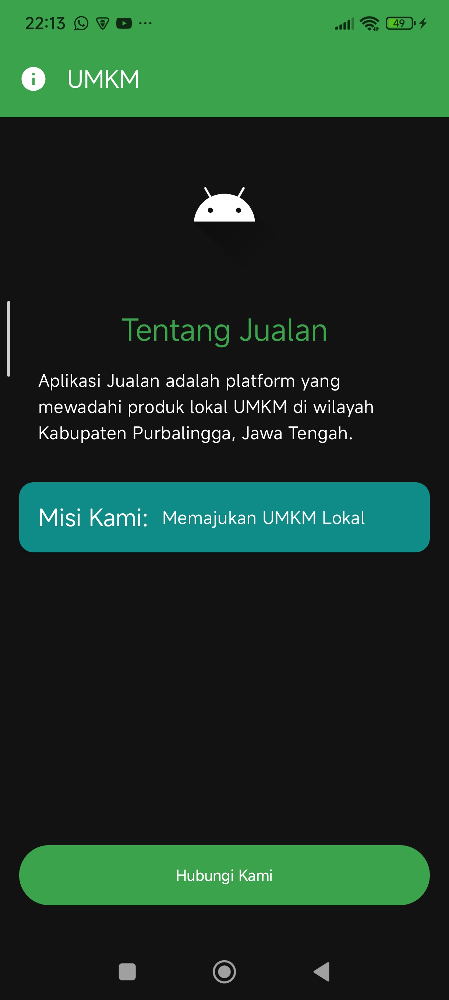
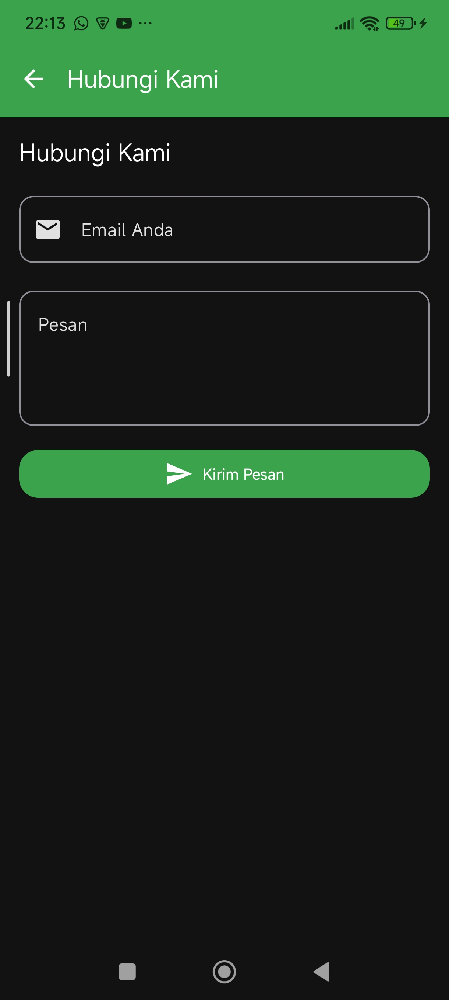

**Kesimpulan Praktikum:**  
Pertemuan kedua menekankan pada implementasi fitur interaktif dalam aplikasi mobile. Mahasiswa belajar bagaimana menghubungkan antarmuka dengan logika program sehingga aplikasi dapat merespons input pengguna secara dinamis dan memberikan pengalaman yang lebih baik.

---

## 📝 Tugas Pertemuan 3
**Tanggal**: Selasa, 15 September 2026

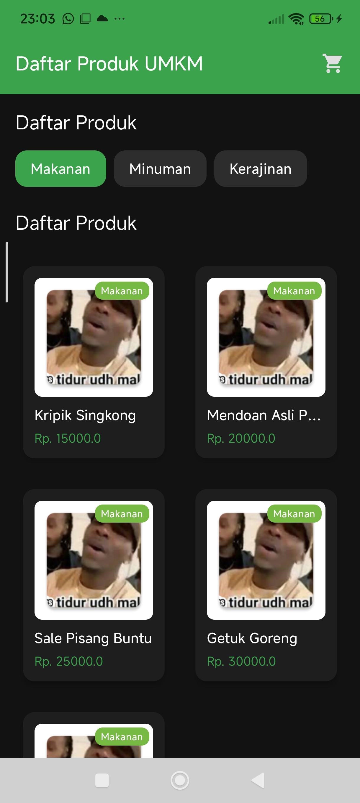

**Kesimpulan Praktikum:**  
Pertemuan ketiga membuka wawasan tentang pengembangan aplikasi mobile yang lebih kompleks. Mahasiswa belajar bagaimana mengintegrasikan berbagai komponen dan fitur untuk menciptakan aplikasi yang lebih lengkap dan bermanfaat.

---

## 📝 Tugas Pertemuan 4
**Tanggal**: Selasa, 15 September 2026

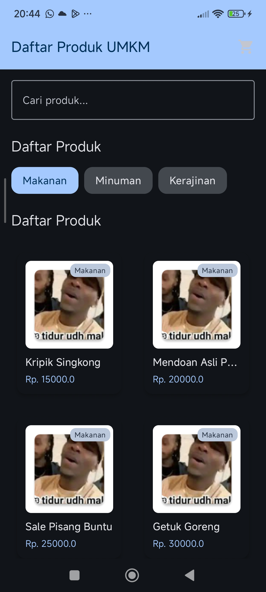
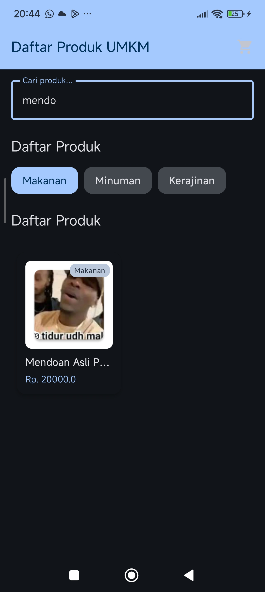
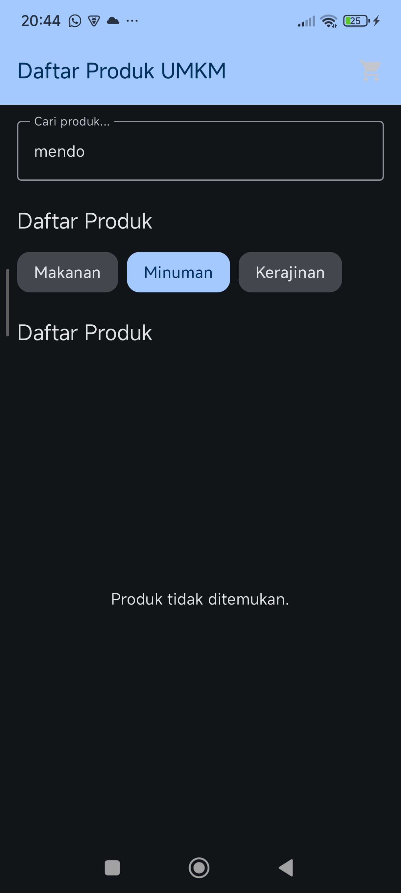
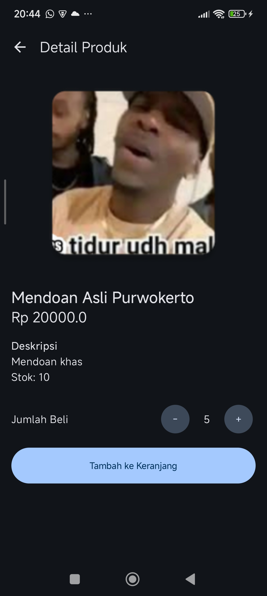
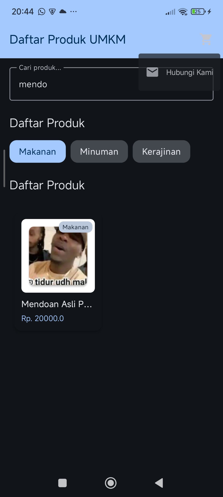
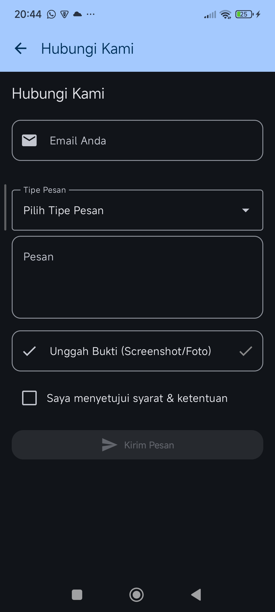

**Kesimpulan Praktikum:**  
Berfokus pada penerapan State, Recomposition, dan State Hoisting pada Jetpack Compose. Mahasiswa belajar mengelola alur data dan validasi pada formulir interaktif, serta menjalankan proses asinkronus (Coroutine) untuk membuat antarmuka aplikasi yang responsif.

---

## 📝 Tugas Pertemuan 4
**Tanggal**: Selasa, 29 September 2026

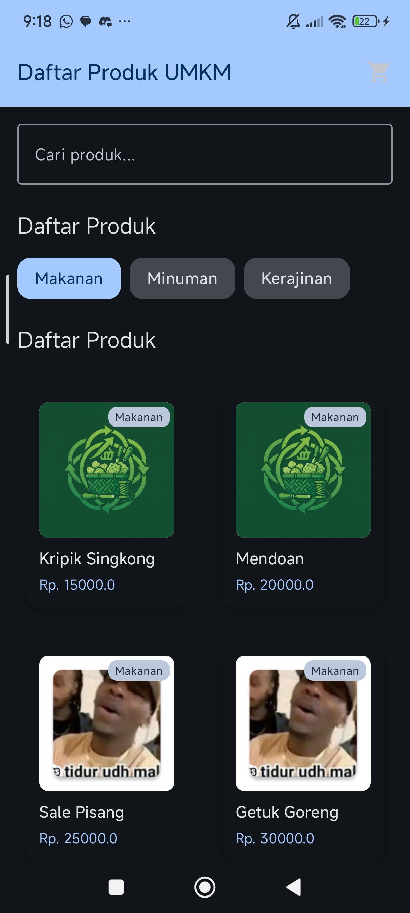
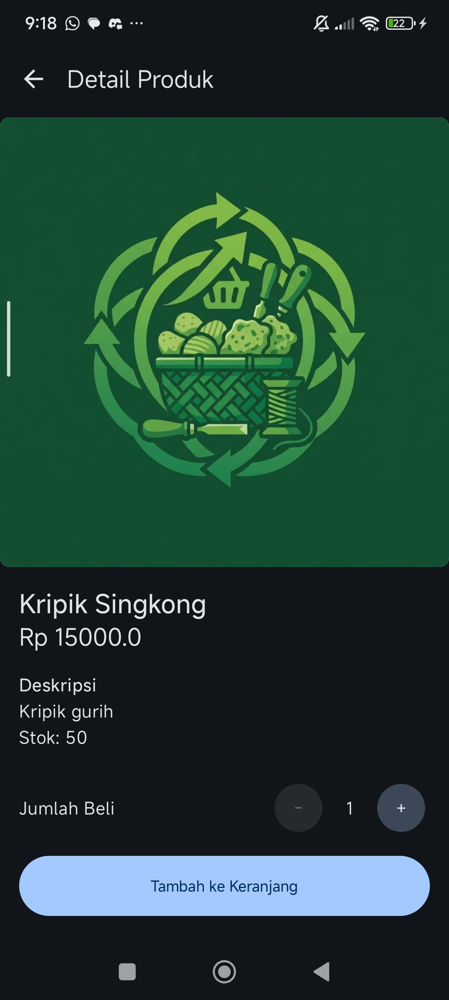

**Kesimpulan Praktikum:**
Berfokus pada penerapan Networking dan pola arsitektur MVVM (Model-View-ViewModel) pada Jetpack Compose. Mahasiswa belajar mengonsumsi API berformat JSON menggunakan pustaka Retrofit, mengelola kondisi antarmuka pengguna (UI State) secara asinkronus menggunakan StateFlow, serta mengorganisasi struktur kode aplikasi agar lebih terstruktur dan mudah dirawat.